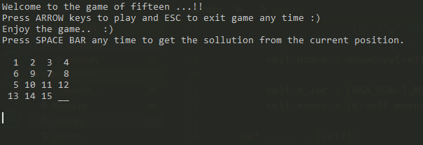
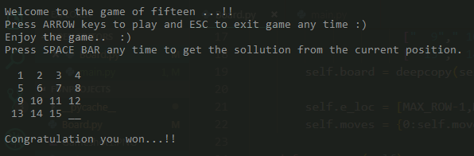
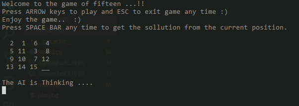

# GAME OF FIFTEEN
This is the Sample of the game called GAME OF FIFTEEN OR FIFTEEN PUZZLE.

# GAME PLAY
To play this game you have to got the the funProjects folder in cmd(Command Prompt)
and run the python file by typing the command  `python main.py` 

## GAME INSTRUCTIONS
  Follow the instructions given in the game
  -you can play your moves by using up,down,left,right keys
  -you can quit the game by pressing ESC
  -you can get the AI help to find the optimal Solution by Pressing SpaceBar 
 
 # Few Screen Shots of the Game

